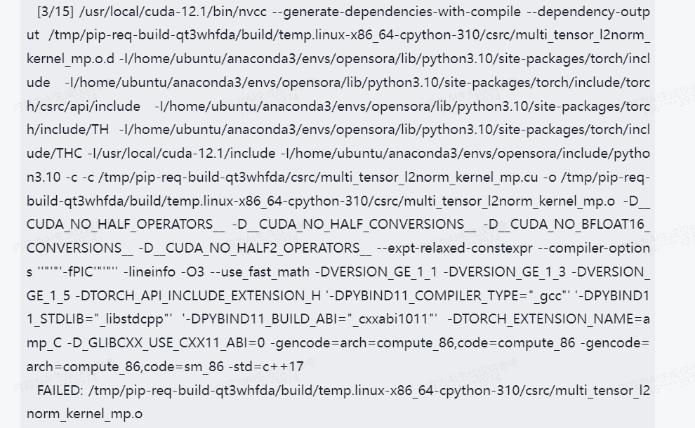

# 1. 不支持Windows系统
Open-Sora默认不支持Windows系统安装，如果前面一直按照文档介绍安装了依赖，会发现到最后一步安装Open-Sora的时候报错，前功尽弃
#### 解决方案
1. 改用Linux系统
2. Windows系统使用wsl(实测可行)
# 2. Pytorch版本、cuda版本必须对应
比如torch__version__是2.3.0+cu121
确保cuda是1.21，实测1.24会报错，前面的flash-attention、Apex就会开始报错
# 3. Apex安装报错
Apex本身在Windows上编译也不稳定，问题多。改为wsl上编译之后依然报错

#### 解决方案
经过分析为nvcc进程被杀死，由于系统资源不足导致，所以提前设置
```
export MAX_JOBS=4
```
之后编译就通过啦。
